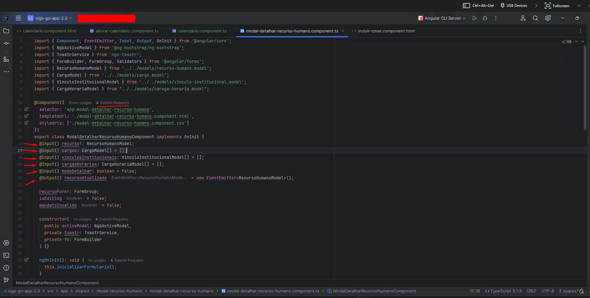

## Questão 4

Trabalhei em um projeto chamado SIGS-GO, que é voltado para o cofinanciamento estadual do estado de Goiás.  
Nesse projeto, utilizei componentes que faziam uso de @Input() e @Output() com EventEmitter para comunicação entre componentes no Angular.

Havia um componente que recebia e emitia dados para outro componente, permitindo a interação entre eles.

- **@Input()**  Permitia que o componente recebesse dados de um componente pai.  
- **@Output()** Permitia que o componente emitisse eventos para o componente pai, enviando informações sempre que necessário.

Essa abordagem possibilitou a criação de um sistema modular, reutilizável e de fácil manutenção, garantindo uma comunicação eficiente entre os componentes da aplicação.

Irei disponibilizar um print do código contendo minha assinatura de commit. Como se trata de algo irrelevante e não contém nenhuma regra de negócio sensível, não vejo problemas em compartilhá-lo.

