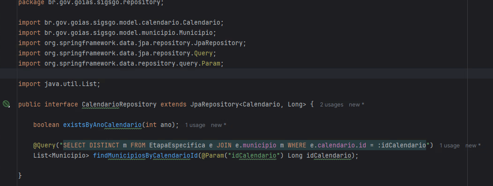

## Questão 5
Para prevenir SQL injection em aplicações web, utilizo ORM (Object-Relational Mapping), como JPA/Hibernate, para abstrair a comunicação com o banco de dados.  
Em vez de escrever SQL puro, prefiro utilizar JPQL (`@Query`) ou métodos automáticos do Spring Data JPA (`findBy`), garantindo consultas seguras e otimizadas.

O ORM é uma boa contra SQL Injection pq 
as consultas são parametrizadas automaticamente, eliminando a necessidade de concatenar strings SQL manualmente.
JPQL e Criteria API não permitem manipulação direta do SQL, reduzindo bastante os riscos de ataques (não existe sistema 100% seguro).
E o Hibernate converte as queries JPQL em SQL seguro, garantindo compatibilidade com o banco.

Deixarei um exemplo básico abaixo.
